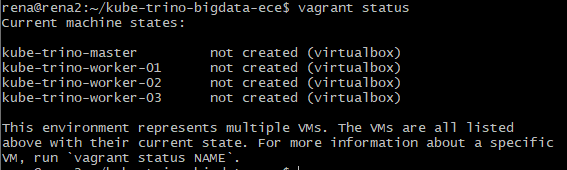
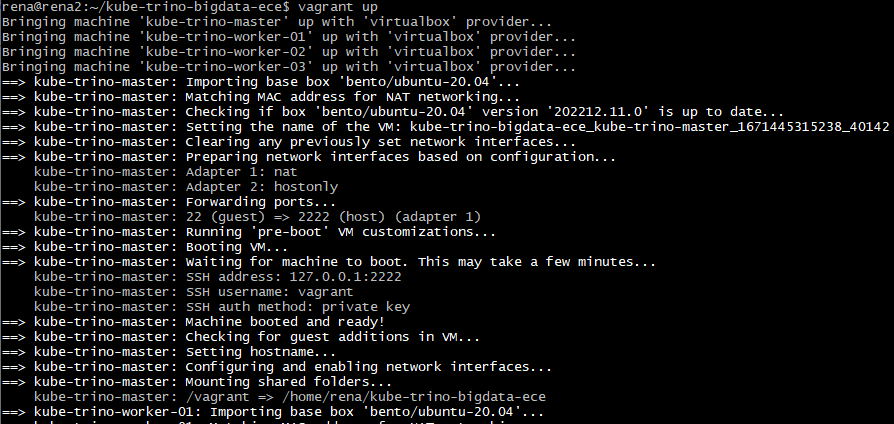
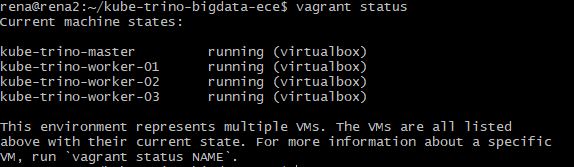

# Setting up VMs for Kubernetes

Our cluster's creation is going to be automated. This goes from the **creating of the hosts of the cluster themselves**.

In order to achieve this, two mains tools exist to create & subsequently provision VMs automatically:

- [Vagrant](https://www.vagrantup.com/)
- [Terraform](https://www.terraform.io/)

We have chosen to use Vagrant, a tool we were familiar with.

## What is Vagrant?

Vagrant is a tool developed by [Hashicorp](https://www.hashicorp.com/). It is a popular and powerful Infrastructure as Code (IaC) tool.

Vagrant is able to create VMs using different virtualization providers. Some providers include:

- [VirtualBox](https://www.virtualbox.org/)
- [VMware](https://www.vmware.com/)
- KVM & QEMU

Ideally, the KVM & QEMU technologies are preferred for their speed & proximity to the original machine's kernel.

We have tried to use libvirt, but because the host we are using for this projet does not support KVM, we used VirtualBox instead. Our steps for using libvirt are still documented below.


## Installing VirtualBox provider

On the host-machine, assuming a Debian host, run the following commands:

```
sudo apt get update
sudo apt install virtualbox
```

## Using VirtualBox provider

A Vagrantfile using either VirtualBox or libvirt will change when configuring the machines themselves.

We have built our Vagrantfile by drawing inspiration from an existing Vagrantfile created by Luka Bigot in an Adaltas repository, [which can be found here](https://github.com/adaltas/demo-k8s-mini/blob/main/Vagrantfile).

[Our Vagrantfile for this project can be found here in the repository](https://github.com/Erzangel/kube-trino-bigdata-ece/blob/main/Vagrantfile).

While the memory and CPU specifications are easy to specify, adding additional disks is trickier with VirtualBox and Vagrant. We have drawn direct inspiration to how it has been achieved in the above link, which is itself inspired by the solution provided in [this Adaltas article](https://www.adaltas.com/en/2019/09/09/rook-ceph-k8s/#the-solution).

Care should be taken with the constraints of each provider. For example, VirtualBox only allows IP adresses in the `192.168.56.0/21` range for its VMs. We originally wished to use the `192.168.34.10` IP address for our master VM which corresponds to the private IP addresses range, but VirtualBox forbids it by default.

Therefore, our machines use the following IP addresses:

- `192.168.58.10` for the master,
- `192.168.58.11`, `192.168.58.12`, `192.168.58.13` for the workers.

## Screenshots of VM creation

Before creating VMs, let us run `vagrant status` to check if the Vagrantfile is parsed correctly and if any VM is currently up:



Then, we run `vagrant up`. The machines start creating themselves. This process usually takes a little while with VirtualBox:



Finally, once the process is done, our VMs are running in the background. We can observe that this is the case with another `vagrant status`:



## (Optional) Using libvirt

For `libvirt` to be used on a host, we must first verify that the KVM module is loaded and that our system supports it with `kvm-ok`.

We install all libvirt utilities on our Ubuntu host:

```
sudo apt install qemu-kvm libvirt-daemon-system libvirt-clients bridge-utils
```

We also need to install the vagrant-libvirt plugin for libvirt boxes support:

```
vagrant plugin install vagrant-libvirt
```

Here is an example of a libvirt Vagrantfile:

```
Vagrant.configure("2") do |config|
  config.vm.box = "generic/ubuntu1804"
  config.vm.provider :libvirt do |libvirt|
    libvirt.graphics_type = "none"
	libvirt.memory = 3072
    libvirt.cpus = 4
    libvirt.storage :file, :size => '5G', :type => 'qcow2'
  end
end
```

## Installing Ansible

Because we are also going to want to automate further provisioning in the VMs we create with Vagrant, we also wish to install Ansible.

Using a package manager, it is very simple:

```
sudo apt update
sudo apt install ansible
```

[To 1. Deploying Kubernetes](1-deploying-kubernetes.md)