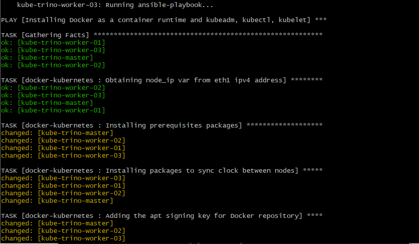

# Deploying Kubernetes

In order to deploy Kubernetes on our machine, we have decided to use `kubeadm`.

We have followed the official guidelines provided [here](https://kubernetes.io/docs/setup/production-environment/tools/kubeadm/install-kubeadm/), which indicate the following steps:

- Installing a container runtime
- Installing `kubeadm`, `kubelet` and `kubectl`
- Running the commands to create the cluster

## Installing a container runtime: Docker

We have followed the official documentation to install Docker on our Ubuntu VMs, which can be found [here](https://docs.docker.com/engine/install/ubuntu/#install-using-the-repository).

To sum it up, we need to install the following packages as prerequisites: `ca-certificates`, `curl`, `gnupg` and `lsb-release`.

Then, we run the following commands:

```shell
sudo mkdir -p /etc/apt/keyrings
curl -fsSL https://download.docker.com/linux/ubuntu/gpg | sudo gpg --dearmor -o /etc/apt/keyrings/docker.gpg
echo \
  "deb [arch=$(dpkg --print-architecture) signed-by=/etc/apt/keyrings/docker.gpg] https://download.docker.com/linux/ubuntu \
  $(lsb_release -cs) stable" | sudo tee /etc/apt/sources.list.d/docker.list > /dev/null
  
sudo apt-get update
sudo apt-get install docker-ce docker-ce-cli containerd.io
```

## Using Ansible roles

As we use an IaC approach in our project, we are going to automate all of those steps as tasks in an Ansible role. Said role [can be found here](../roles/docker-kubernetes/tasks/main.yml).

Note: The commands described above can be run with Ansible using the `command` or `shell` module. However, as described in [this article](https://www.ansiblepilot.com/articles/ansible-modules-command-vs-shell/), it is preferred to use built-in Ansible modules when possible.

Because we add an apt key and an apt repository, we use the corresponding modules in Ansible:

```yaml
- name: Adding the apt signing key for Docker repository
  become: yes
  apt_key:
    url: https://download.docker.com/linux/ubuntu/gpg
    state: present

- name: Adding apt repository for stable version of Docker
  become: yes
  apt_repository:
    repo: deb [arch=amd64] https://download.docker.com/linux/ubuntu xenial stable
    state: present
```

In the same way, when we install packages, we use the `apt` module:

```yaml
- name: Installing prerequisites packages
  become: yes
  apt:
    name: "{{ packages }}"
    state: present
    update_cache: yes
  vars:
    packages:
    - ca-certificates
    - curl
    - gnupg
    - lsb-release
    - apt-transport-https
```

When we run `vagrant up`, the Vagrantfile defines that Ansible is called when the last machine is created, for all machines, running each task in parallel for all machines.

Here is a screenshot of the Ansible provisioning starting:



## Installing kubeadm, kubelet, kubectl

The official documentation provides steps to install each of the components [in this section of the above link](https://kubernetes.io/docs/setup/production-environment/tools/kubeadm/install-kubeadm/#installing-kubeadm-kubelet-and-kubectl).

In a nutshell, it requires installing the `apt-transport-https`, `ca-certificates` and `curl` packages and running the following commands:

```shell
sudo curl -fsSLo /etc/apt/keyrings/kubernetes-archive-keyring.gpg https://packages.cloud.google.com/apt/doc/apt-key.gpg
echo "deb [signed-by=/etc/apt/keyrings/kubernetes-archive-keyring.gpg] https://apt.kubernetes.io/ kubernetes-xenial main" | sudo tee /etc/apt/sources.list.d/kubernetes.list

sudo apt-get update
sudo apt-get install -y kubelet kubeadm kubectl
sudo apt-mark hold kubelet kubeadm kubectl
```

Once again, we run those commands in the same Ansible role referenced above, using the dedicated Ansible modules.

After these installations, we make sure to enable the kubelet service. Also, kubelet cannot work if swap is enabled on the VMs, so we disable it:

```yaml
- name: Enabling kubelet service
  become: yes
  command: "{{ item }}"
  with_items:
    - systemctl enable --now kubelet
    
- name: Disabling swap
  become: yes
  command: "{{ item }}"
  with_items:
    - swapoff -a
    - sed -i '/ swap / s/^/#/' /etc/fstab
  when: ansible_swaptotal_mb > 0
```

## Creating the Kubernetes cluster with kubeadm

In order to create the Kubernetes cluster, we are going to run the `kubeadm init` command on the master node.

Because this command can take a lot of different parameters, we chose to specify all of those in a configuration file. We name this file `kubeadm-config.yaml`, which is located in the `config/` folder in the repository, [here](../config/kubeadm-config.yaml).

The content of this file is based on the same configuration file used in the `demo-k8s-mini` repository, made by Luka Bigot. Said configuration file can be found [here](https://github.com/adaltas/demo-k8s-mini/blob/main/resources/kubeadm/kubeadm-config.yaml).

This configuration file contains information such as the Kubernetes pods subnet, cgroup driver to use, as well as the API-server IP. This IP must be fetched at runtime, and so we write a field named `ANSIBLE_NODE_IP`, which will be replaced by an Ansible task with the `sed` command.

The configuration file looks as follows:

```yaml
kind: ClusterConfiguration
apiVersion: kubeadm.k8s.io/v1beta3
clusterName: "k8s-cluster"
kubernetesVersion: "v1.23.8"
networking:
  podSubnet: 10.244.0.0/16
---
kind: KubeletConfiguration
apiVersion: kubelet.config.k8s.io/v1beta1
cgroupDriver: systemd
# resolvConf: ""
---
apiVersion: kubeadm.k8s.io/v1beta3
kind: InitConfiguration
bootstrapTokens:
- groups:
  - system:bootstrappers:kubeadm:default-node-token
  token: abcdef.0123456789abcdef
  ttl: 24h0m0s
  usages:
  - signing
  - authentication
localAPIEndpoint:
  advertiseAddress: ANSIBLE_NODE_IP
  bindPort: 6443
---
```

This configuration file is going to be imported from the host VM to the master node using the copy command.

The command used to create the Kubernetes cluster with `kubeadm` is:

```shell
kubeadm init --config kubeadm/kubeadm-config.yaml
```

Then, it is possible to copy the `.kube/config` file for different users, which can then interact with the Kubernetes cluster on the master node.

## Joining the Kubernetes cluster on the other nodes

First, we need to export a join command from the master node, which we then provide to the other nodes through Ansible by copying it to a temporary file.

```shell
kubeadm token create --print-join-command
```

Then, on each worker node, we execute this join command, which we propagate to each node as a file called `join-command.sh`:

```shell
sh /tmp/join-command.sh
```

The Kubernetes cluster is then established! All that is needed for it to function correctly is to install a CNI (Container Network Interface) and basic services.

[To 2. Basic Kubernetes services](2-basic-kubernetes-services.md)