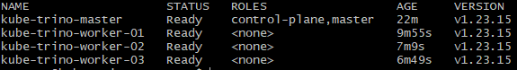

# Basic Kubernetes Services deployment

The Kubernetes cluster is now created with `kubeadm`. The very first step is to install a [CNI (Container Network Interface)](https://kubernetes.io/docs/concepts/extend-kubernetes/compute-storage-net/network-plugins/).

Multiple CNIs exist, providing different benefits and levels of customization. Since our needs are relatively basic, we decided to use the [Calico](https://www.tigera.io/project-calico/) CNI, providing ideal functionality and security out of the box.

Installing Calico is quite simple: we download the Calico manifest (a YAML file containing the Calico deployment specs), and we tell `kubectl` to apply this manifest on the cluster:

```shell
curl https://projectcalico.docs.tigera.io/manifests/calico.yaml -O
kubectl apply -f calico.yaml
```

We can run the next command, which waits for the Calico pods to be up before proceeding:

```shell
kubectl rollout status deployment/calico-kube-controllers -n kube-system
```

And as per usual, since we work in an IaC approach, we create a role to run all of those commands after the cluster has been created.

After deploying the CNI, the nodes in the cluster are considered ready, as seen by running `kubectl get nodes`:



During this step, it would have been possible to install an Ingress controller in the cluster, or to take care of certificate-related matters. However, because this is a test cluster and because we want to deploy MinIO and Trino on Kubernetes in a simple & quick way, we choose not to.

[To 3. MinIO Object Storage](3-minio-object-storage.md)