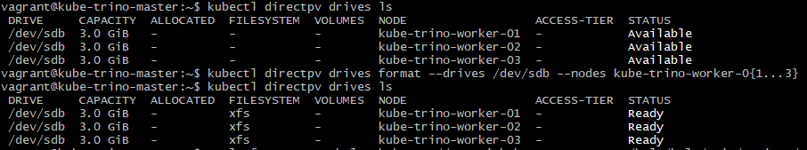

# MinIO Object Storage on the cluster

Because storage is a difficult thing to handle properly in a Kubernetes cluster and because object storage is easy to query from & convenient in a data analysis context, we chose to deploy MinIO.

MinIO is a distributed, Kubernetes-native object storage solution. It is a simple solution to deploy which can be configured in complex ways, but we choose to configure it simply for Trino to later consume files from it.

Installing MinIO from scratch can be tricky, and could have been the goal of this project entirely. Thankfully, our group member Luka Bigot [wrote an article on the Adaltas website](https://www.adaltas.com/en/2022/07/09/s3-object-storage-minio/) providing steps to deploy MinIO on our Kubernetes cluster. **We have followed this article to deploy MinIO in the cluster quickly, which we achieved and automated in 3 hours.**

As per the article, the steps are:

1. Formatting disks with DirectPV,
2. Installing MinIO through the MinIO Operator and Helm

## Issues encountered

We have encountered multiple issues while deploying MinIO.

**As of now, the MinIO deployment is not fully functional**. We have tried our best to fix it, but lacked time.

Details on the issues encountered [can be found in the project report](../project_report.md#list-of-problems-encountered).

## Formatting disks with DirectPV

Before installing MinIO itself, the disks on the worker nodes must be prepared & formatted.

We install [DirectPV](https://github.com/minio/directpv) with the [Krew](https://krew.sigs.k8s.io/) kubectl plugin in order to detect & format the disks present on the cluster, as indicated in the article.

The disks we created with VirtualBox are named `/dev/sdb`, `/dev/sdc` inside the machines. We thus target this drive name when running the `kubectl directpv drives format` command:

```shell
kubectl directpv drives format --drives /dev/sd{b...c} --nodes kube-trino-worker-0{1...4}
```

Once we formatted the drives, performing the `kubectl directpv drives ls` provides the following output:



## Installing MinIO on the cluster through the MinIO Operator

Installing MinIO on Kubernetes in a distributed way is done with the [MinIO Operator](https://github.com/minio/operator), which deploys MinIO Tenants.

The MinIO Operator is deployed in the Kubernetes cluster, and also deploys a Console for web access if this is configured. It is the MinIO Operator which then handles the creation of MinIO clusters. It is possible to have multiple MinIO clusters, each running their own storage pods, as MinIO supports multi-tenancy.

The tutorial provided in the article provides two different ways to install the MinIO Operator and Tenant:

- Through Krew (the same kubectl plugin used to install DirectPV) & using subsequent CLI commands to install the operator & create clusters
- Through [Helm](https://helm.sh/), a popular package manager for Kubernetes, providing elegant ways to deploy both components using pseudo-manifests, called value files.

As the latter option is convenient to store the entire desired configuration in one place, we chose it.

### Configuring the Helm charts values

As described in the article, the default values of the Helm Charts (a Chart is similar to a pre-built deployment in Helm) can be adjusted for our own needs.

In particular, we need to specify how many servers we want, and how many hard disks are used in each server, and their size.

In order to achieve this easily, we have our own modified versions of the values file in this repository.

[Those values file can be found here](../config/) under the names `operator-values.yaml` and `tenant-values.yaml`.

[To 4. Processing with Trino](4-trino-processing.md)