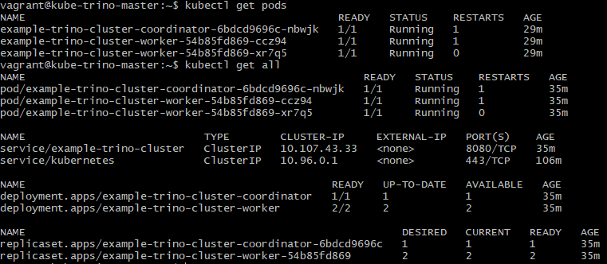
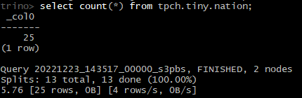

# Distributed processing in Kubernetes with Trino

Trino is a Kubernetes equivalent to Hive.

Our goal in this cluster is to deploy Trino and use it on data queried from object storage within the same cluster.

## Installing Trino

We have followed [official documentation](https://trino.io/docs/current/installation/kubernetes.html) to deploy Trino on our Kubernetes cluster, which is done with Helm.

Helm has been installed in the MinIO step, so we do not need to install it again. We simply need to execute the following commands:

```shell
helm repo add trino https://trinodb.github.io/charts
helm install example-trino-cluster trino/trino
```

Much like MinIO's install with Helm, it is possible to use a values file containing the desired Trino configuration.

After the above command is run, we see that the Trino components are deployed in the cluster after a little while:



## Using Trino

The first step is to port-forward traffic from the coordinator pod to our host VM: we decide to query Trino from outside the cluster.

This port-forwarding is done with the following command in a terminal logged into the master node:

```shell
POD_NAME=$(kubectl get pods -l "app=trino,release=example-trino-cluster,component=coordinator" -o name)
kubectl port-forward $POD_NAME 8080:8080
```

Then, we go back to our host VM and we install the Trino Command Line Interface.

### Installing Trino CLI

The Trino CLI requires Java to be installed. On an Ubuntu machine such as our own, this is achieved with:

```shell
sudo apt update
sudo apt install default-jdk
```

Then, download the Trino self-executing JAR, grant it execute permissions and test if it runs correctly:

```shell
curl -fsSL -o trino https://repo1.maven.org/maven2/io/trino/trino-cli/403/trino-cli-403-executable.jar
sudo chmod +x trino
./trino --version
```

Once this is done, we connect to the Trino cluster running in Kubernetes with the following command:

```shell
trino --server http://localhost:8080
```

And then, in the Trino CLI, we run the example query to check that it is working:

```shell
trino> select count(*) from tpch.tiny.nation;
```

This provides the following result:

